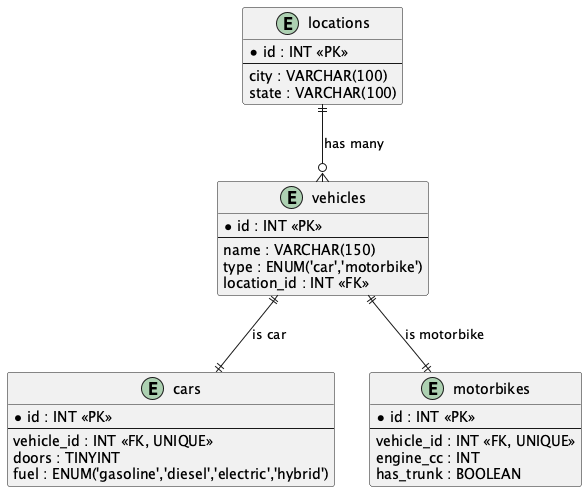

# oop-mvc-cli-php

This is a simple **console application** written in **PHP (OOP, layered design)** with a **MySQL database**.  
It demonstrates clean code practices, database design, and multilingual support.

The application allows searching vehicles (cars and motorbikes) by the **first three letters of their name**, retrieving detailed information including type-specific attributes and location.

---

## 🚀 Running the Application

### Using Docker

1. Make sure Docker and Docker Compose are installed
2. Clone this repository
3. Run the application:
```bash
docker compose run php php src/cli.php abc
```

---

## 📂 Project Structure

```
/src        -> PHP source code (entities, repositories, services, CLI entry point)
/tests      -> PHPUnit test cases
/sql        -> SQL scripts (schema + seed data)
/docs       -> Documentation (ERD diagrams, notes)
README.md   -> This file
```

---

## 📊 Documentation

- Entity-Relationship Diagram (PlantUML): [`/docs/erd.puml`](./docs/erd.puml)
- Rendered diagram (PNG/SVG) available in the same folder.

Example (if exported to PNG):



---

## 🌍 Internationalization

The database and codebase use **UTF-8 (utf8mb4)** to support multiple languages, including non-Latin alphabets (Arabic, Chinese, etc.).

---

## 📌 Notes

- No external frameworks are used.
- The project focuses on **OOP principles, layered architecture, and testability**.
- This repo is a **demo project** intended for portfolio purposes.
  """
